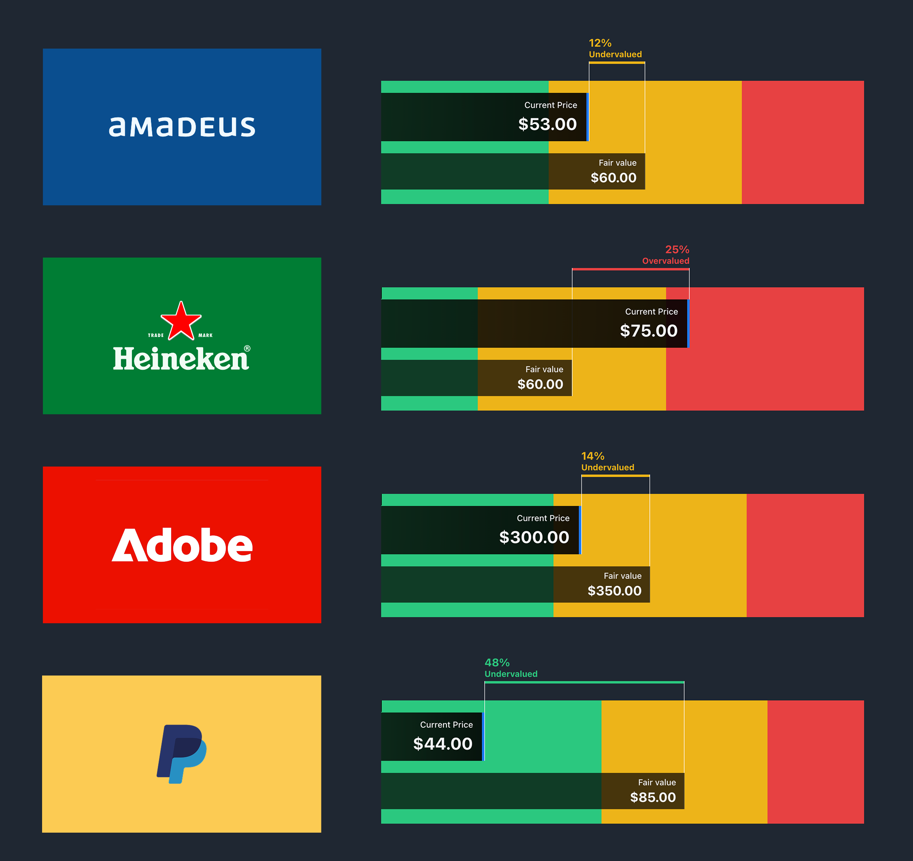

# ValuationBar — Documentación técnica




## 1. Descripción

`ValuationBar` es un componente React que visualiza la relación entre un precio actual (`currentValue`) y un valor justo (`fairValue`) sobre una barra segmentada en tres zonas:

- **Verde**: infravalorado (*undervalued*)
- **Amarillo**: cercano al valor justo
- **Rojo**: sobrevalorado (*overvalued*)

Además, renderiza:

- una barra para **Current Price**,
- una barra para **Fair Value**,
- un indicador con porcentaje de desviación y etiqueta de valoración.

---

## 2. Ubicación

- Componente: `src/components/ValuationBar/ValuationBar.jsx`
- Estilos: `src/components/ValuationBar/valuation-bar.css`

---

## 3. API (props)

| Prop | Tipo | Requerido | Default | Descripción |
|---|---|---:|---|---|
| `currentValue` | `number` | Sí | - | Precio actual principal. |
| `fairValue` | `number` | Sí | - | Valor justo de referencia (debe ser `> 0`). |
| `isoCurrency` | `string` | No | `"USD"` | Moneda ISO para formateo (`USD`, `EUR`, `GBP`, `JPY`, etc.). |
| `tolerance` | `number` | No | `0.2` | Tolerancia alrededor de `fairValue` (ej. `0.2` = ±20%). |

---

## 4. Flujo de cálculo interno

La lógica principal se encapsula en `useMemo` para evitar recálculos innecesarios.

### 4.1 Validación

Se convierten valores a número:

- `cp = Number(currentValue)`
- `fv = Number(fairValue)`

Estado inválido cuando:

- `cp` no es finito,
- `fv` no es finito,
- `fv <= 0`.

En caso inválido se renderiza mensaje de error.

### 4.2 Rango de tolerancia

- `low = fv * (1 - tolerance)`
- `high = fv * (1 + tolerance)`

Determinación de zona:

- `cp < low` → `green`
- `cp > high` → `red`
- en otro caso → `yellow`

### 4.3 Reparto porcentual de segmentos

Los anchos de los segmentos (`greenPct`, `yellowPct`, `redPct`) se adaptan dinámicamente según severidad y sesgo:

- En zona amarilla: el amarillo queda fijo en 40% y verde/rojo se balancean por proximidad al borde superior/inferior.
- En zona verde o roja: el segmento dominante crece (hasta un límite) según distancia respecto al umbral.

### 4.4 Escala y posiciones

Con los porcentajes se calcula una escala lineal para mapear valores a coordenadas de ancho (`0–100%`):

- `xFair`: posición de `fairValue`
- `xCurrent`: posición de `currentValue`

De ahí se obtienen:

- `fairBarWidth`
- `currentBarWidth`
- `indicatorLeft`
- `indicatorWidth`

### 4.5 Formateo monetario

Se usa `Intl.NumberFormat` con locale sugerido por moneda:

- `USD → en-US`
- `EUR → es-ES`
- `GBP → en-GB`
- `JPY → ja-JP`

Si la moneda no está mapeada, usa `en-US` como fallback de locale.

---

## 5. Renderizado

Estructura principal:

1. Contenedor raíz `.vr-wrap`
2. Lienzo `.vr-canvas`
3. Segmentos de color `.vr-seg` (`.vr-green`, `.vr-yellow`, `.vr-red`)
4. Barras superpuestas:
   - `.vr-bar.vr-current`
   - `.vr-bar.vr-fair`
5. Indicador `.vr-indicator` con:
   - línea superior horizontal,
   - texto (`%` y estado),
   - dos líneas verticales de referencia.

Subcomponente interno:

- `BarLabel({ title, value })`: etiqueta reutilizable para ambas barras.

---

## 6. Dependencias y estilo

- Dependencia principal: `react` (`useMemo`).
- Hoja de estilos local: `valuation-bar.css`.
- Variables CSS en `:root`:
  - `--vr-bg`
  - `--vr-white`
  - `--vr-green`
  - `--vr-yellow`
  - `--vr-red`

---

## 7. Comportamiento visual relevante

- El color del indicador depende de la zona (`green`, `yellow`, `red`).
- El texto del indicador cambia alineación según si `current >= fair`.
- La altura de líneas verticales del indicador alterna para reforzar la comparación visual entre ambas barras.

---

## 8. Ejemplo de uso

```jsx
import ValuationBar from "./components/ValuationBar/ValuationBar";

export default function Example() {
  return (
    <ValuationBar
      currentValue={138.4}
      fairValue={120}
      isoCurrency="USD"
      tolerance={0.2}
    />
  );
}
```

---

## 9. Consideraciones técnicas

- **Performance:** `useMemo` reduce cómputo en renders repetidos si props no cambian.
- **Robustez:** valida entradas numéricas y evita división/escala inválida con `fv <= 0`.
- **Extensibilidad:** puede ampliarse para nuevas monedas/locales y tooltips adicionales.
